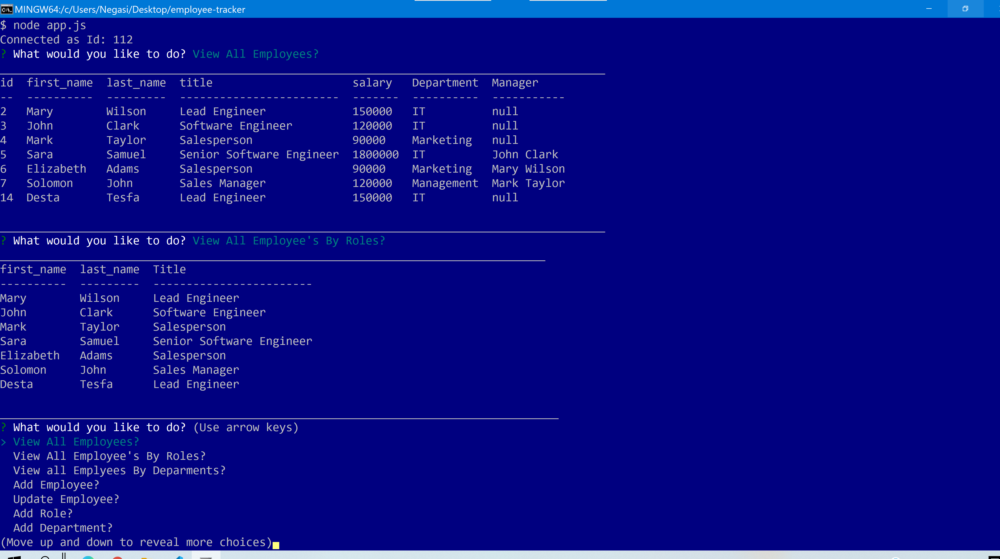
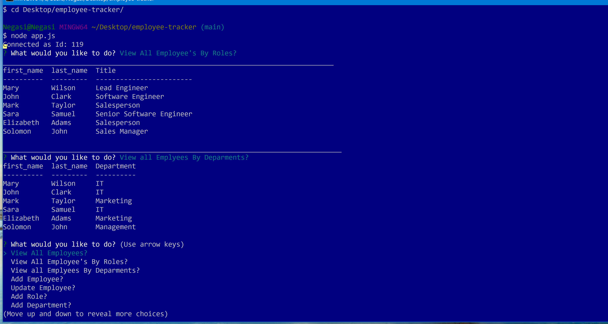
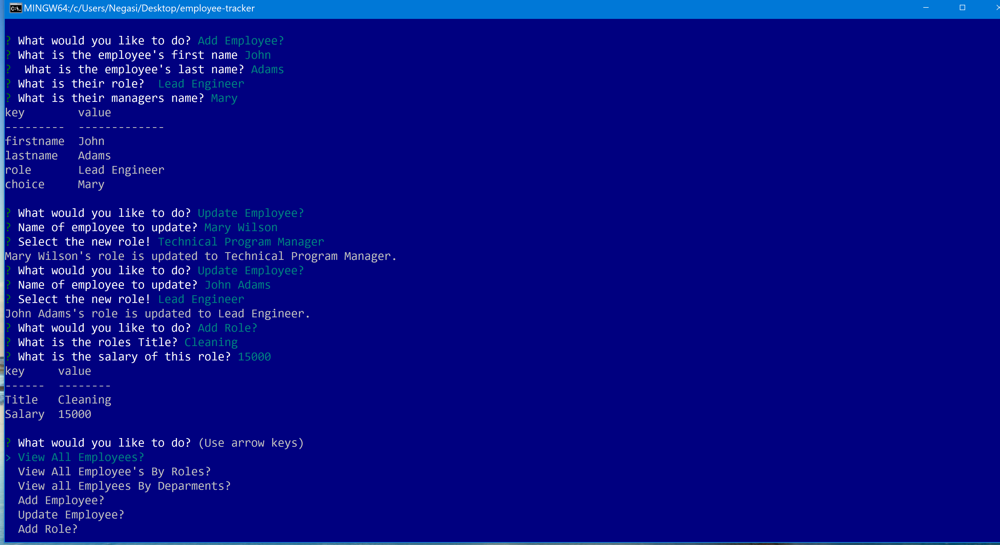

# employee-tracker

## Description
Employee-Tracker is a CLI application for bulding and maintaining employee data base. Build on MYSQL and  this project  app.js, schema.sql and package.json are added to as the main files. The whole fancitionality of the app is included in the app.js that requires the dependency from the package, retrive the datat from the mysql data base and render it to the terminal in a table form.Employee allows managers or someone within the company to view all employees, roles, as well as departments. It also allows for adding employees, roles, departments and updating employees all from your CLI.[negasimichael](#) is the developer of this app.

   ## Table of Contents
   * [Installation Instructions](#installation-instructions)
   
   * [Usage Instructions](#usage-instructions)
   
   * [Contribution](#contribution)
   
   * [Developer Contact Information](#Developer-Contact-Information)
     
  * [License](#license)

  ## Installation Instructions
The developer is authorizing a free installation by cloning from the code [negasimichael](https://github.com/negasimichael/employee-tracker).
   
   ## Usage Instructions
  i. You  can click the link  video demonstrating the entirety of the app's functionality https://drive.google.com/file/d/1hJoCylWKGMt7q16igduLvxucWi2t4pvv/view?usp=sharing

  ii.Make sure node and npm is installed in your computer.

iii.Once in the directory run npm install to install the node_modules needed to run the app.

iv.Then Run node app.js to perform task based on the inquirer prompt.

## Contribution
  [negasimichael]( https://negasimichael.github.io/employee-tracker/) is the only contrubuter of this project .

   ## Developer Contact Information
  * Linkedin Profile: [negasimichael](https://www.linkedin.com/feed/)
  * Deployed URL: [negasimichael](N/A)
  * Github URL: [negasimichael](https://github.com/negasimichael/employee-tracker)
  * Email: negasimichael1@gmail.com

   ## License
   .
 
 ------------------------------------------------------------------------------
© 2021 Trilogy Education Services, a 2U, Inc. brand. All Rights Reserved.
